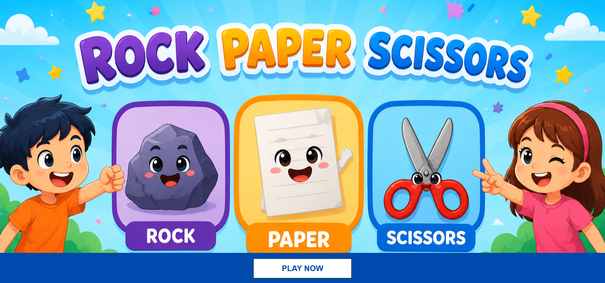
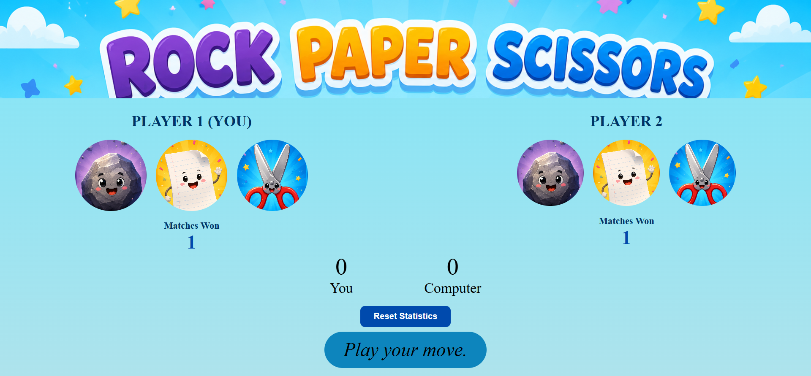
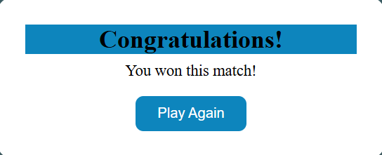

# 🎮 Rock Paper Scissors Game

A fun and interactive **Rock Paper Scissors** game built using **HTML, CSS, and JavaScript**. Challenge the computer, track your scores, and enjoy a responsive and visually appealing gaming experience.

---

## 🚀 Live Demo

🔗 https://Kanika-Jindal20.github.io/Rock-Paper-Scissors/

---

## 📸 Screenshots

### Home Page


### Game Page


### Winner Popup


---

## ✨ Features

- 🎮 Play Rock, Paper, Scissors against the computer
- 🤖 Random computer moves
- 📊 Live score tracking
- 🏆 Match win counter
- 💾 Match statistics saved using Local Storage
- 🔄 Reset Statistics button
- 🔊 Sound effects for:
  - Click
  - Win
  - Lose
  - Draw
- 📱 Fully responsive design
- 🎉 Winner popup after reaching 10 points
- 🎨 Clean and modern user interface

---

## 🛠️ Built With

- HTML5
- CSS3
- JavaScript (ES6)
- Local Storage API

---

## 📂 Project Structure

```
Rock-Paper-Scissors/
│
├── assets/
│   ├── images/
│   └── sounds/
│
├── index.html
├── play.html
├── index.css
├── style.css
├── app.js
└── README.md
```

---

## 🎯 How to Play

1. Open the game.
2. Click **Play Now**.
3. Select **Rock**, **Paper**, or **Scissors**.
4. The computer randomly selects its move.
5. The first player to reach **10 points** wins the match.
6. Match wins are automatically saved.
7. Use **Reset Statistics** to clear all saved data.

---

## 💡 What I Learned

While building this project, I practiced:

- DOM Manipulation
- Event Handling
- Game Logic
- JavaScript Functions
- Local Storage
- Responsive Web Design
- CSS Flexbox
- Sound Effects Integration
- UI Design

---

## 🔮 Future Improvements

- Difficulty Levels
- Multiplayer Mode
- More Animations
- Better Statistics Dashboard

---

## 👨‍💻 Author

**Kanika**

GitHub: https://github.com/Kanika-Jindal20

---

## ⭐ If you like this project

Give this repository a ⭐ on GitHub!